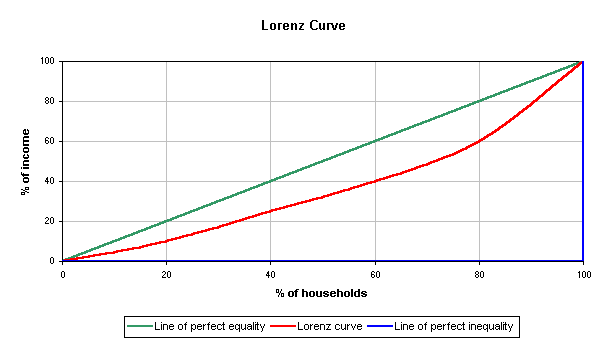
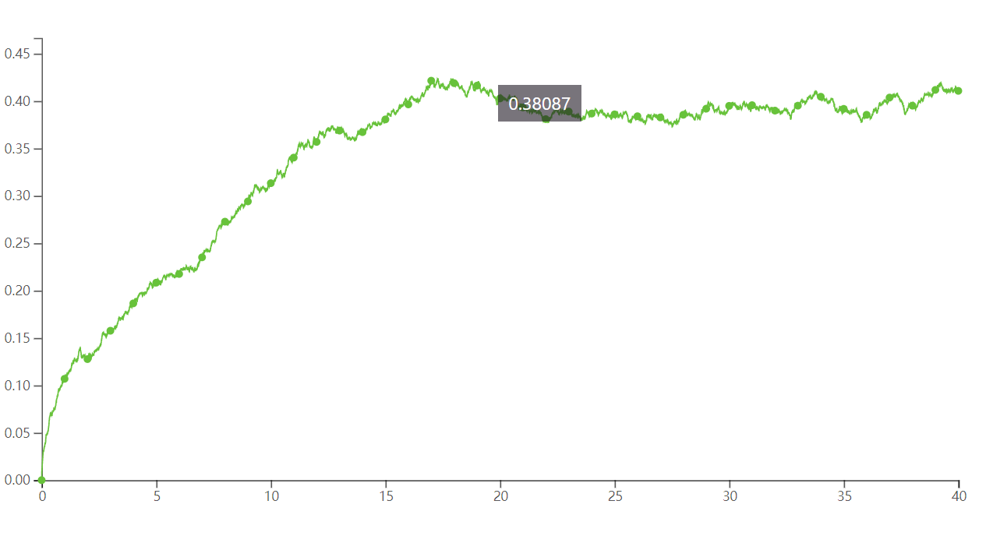

# 使用数学模型解释贫富差距

## 贫富差距

贫富差距（亦称为贫富不均、经济不平等和国民收入不均等）是指一个群体里面每个人之间的经济资产（财富）及收入的分配不均等。本用词一般是指一个社会里面个人或群体之间的收入差距，但亦可用以指出国际贫富差距。贫富差距问题跟经济平等、平等机会及平等结果的概念有关。

## 衡量贫富差距

常用指标：基尼系数

设下图中的实际收入分配曲线（红线）和收入分配绝对平等线（绿线）之间的面积为A，实际收入分配曲线（红线）和收入分配绝对不平等线（蓝线）之间的面积为B，则表示收入与人口之间的比例的基尼系数为$\frac {A}{A+B}$

显然当国民收入绝对平等时，曲线与绿线重合，基尼系数为0；反之，若所有财富都集中在一人手上时，曲线与蓝线重合，基尼系数为1

## 构建模型

这里用一个简单的数学模型模拟财富分配状态，并不能准确计算现实中财富分配状态，甚至结果和实际有较大的出入。这是社会结构的复杂程度，资本积累，政府政策等因素都会影响财富分配。

该数学模型是一开始分配等量的财富给一定数量的人数，然后每天（每次）每个人都会随机给1元到其他成员里，若此人财富为0，则跳过（这里不考虑财富为负数或者欠债的情况）。

> 关于增长率：一个社会群体内部财富一般呈增长状态。当设置了增长率时，则按照增长数量每天（每次）随机分配给某些成员。

## 实验情况

> 这里都是只是运行一次后记录的数据，多次运行取平均值可能更准确

|实验条件|财富中位数|基尼系数|
|---|---|---|---|
|人数：100，时间：10年，增长率：0|102.5|0.33158|
|人数：100，时间：20年，增长率：0|91.5|0.36805|
|人数：100，时间：30年，增长率：0|88|0.39839|
|人数：100，时间：40年，增长率：0|83|0.43576|
|人数：100，时间：50年，增长率：0|83|0.40198|
|人数：100，时间：40年，增长率：1%|125.30|0.36239|
|人数：100，时间：40年，增长率：3%|316.80|0.20241|
|人数：100，时间：40年，增长率：5%|698.01|0.09310|
|人数：100，时间：40年，增长率：9%|3205.84|0.02392|
|人数：100，时间：40年，增长率：10%|5487.15|0.01330|

## 主要国家的基尼系数

[参考](https://data.worldbank.org.cn/indicator/si.pov.gini)

|国家|年份|gini(%)|
|---|---|---|
|中国|2015|38.6|
|美国|2016|41.5|
|俄罗斯|2015|37.7|
|法国|2015|32.7|
|英国|2015|33.2|
|日本|2008|32.1|
|印度|2011|35.7|
|加拿大|2013|34.0|
|巴基斯坦|2015|33.5|
|巴西|2017|53.3|
|澳大利亚|2014|35.8|
|德国|2015|31.7|
|西班牙|2015|36.2|

## 通过数学模型得出的结论

1. 增长率恒定时，随着时间推移，gini系数逐渐趋向稳定

2. 增长率越大，gini系数稳定于某个值更小

3. 该模型并不能真实反映某个国家或社会团体的趋势

